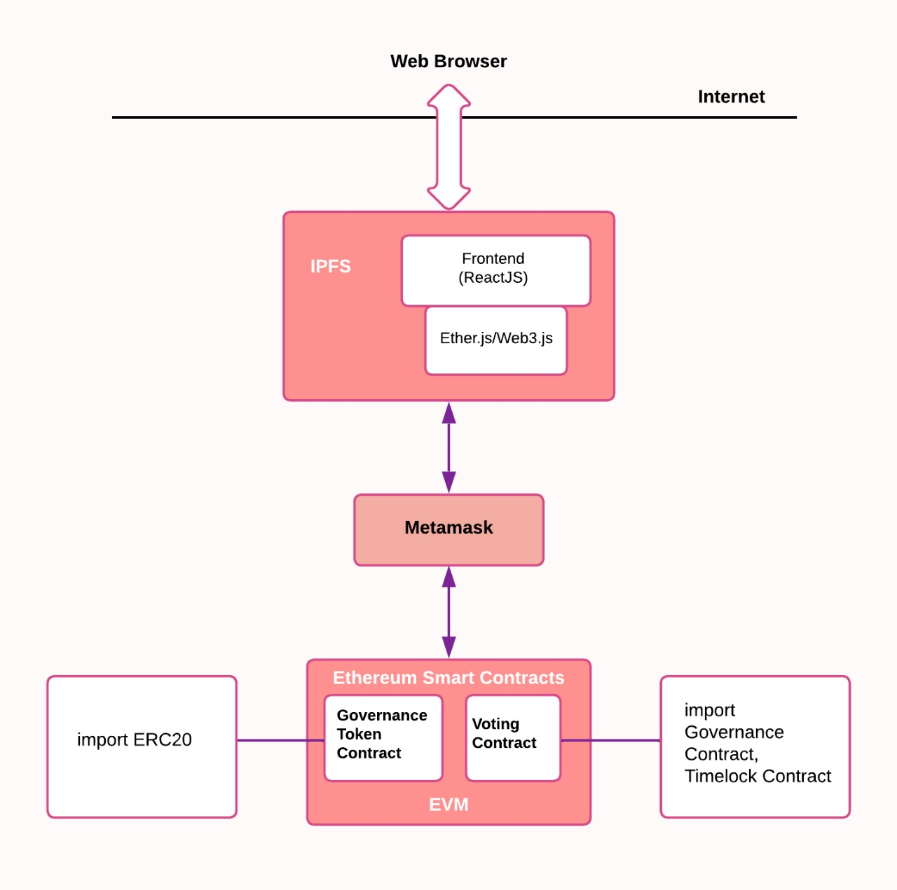
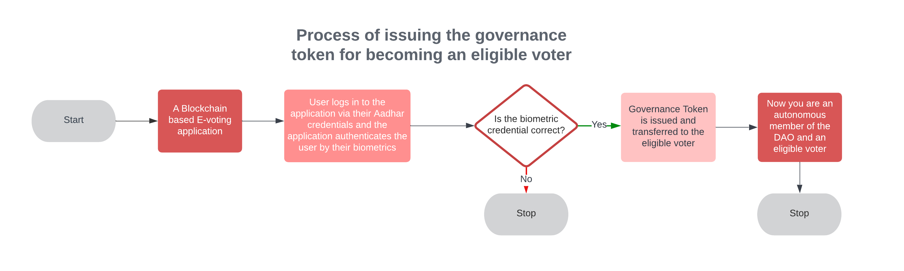
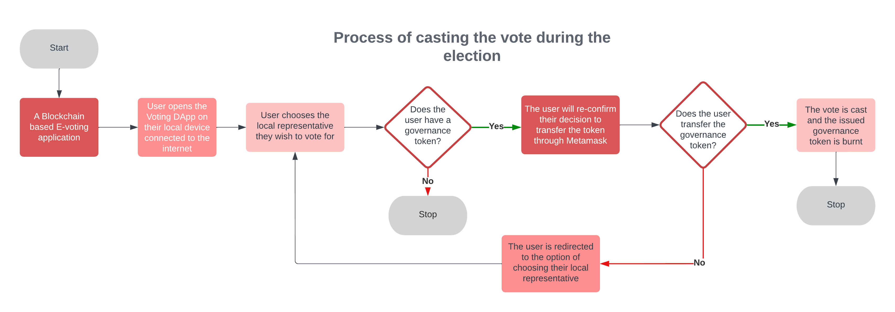

# Voting Dapp
## Abstract
Elections are increasingly being conducted electronically, and the threat of hacking and the insecurity about the integrity and anonymity of voters' choices have created tension between voters and electorate bodies. The proposed voting mechanism employs blockchain technology to ensure a decentralized, transparent, secure electronic voting methodology to offer efficient and justifiable election results to strengthen the democratic election process. Votes and voter details are encrypted by the blockchain-based model in a hash value that cannot be changed and is recorded in a ledger accessible to all, making the process transparent. A decentralized application (DApp) is proposed based on web 3.0 and powered by smart contracts to guarantee a secure means of verifying voters and preventing fraud. The DApp deployed on the Ethereum blockchain, a secure, open-source, decentralized network. The model also includes a Decentralized Autonomous Organization (DAO) to prevent plural voting. We propose this model to use the latest trends in blockchain technology and the web to restore voters' confidence in the democratic process.
   
## Introduction
The Decentralized Application (DApp) is hosted on Web3.0. It is made using ReactJS which is used to design the landing pages of the DApp. React uses a library called Ether.js which helps in the integration and usage of smart contract functions. The DApp interacts with the blockchain (Ethereum network) with the help of the Metamask wallet, which acts as a signer as well as a provider to the decentralized application. 
Ethereum will provide a secure, open-source, and decentralized network. The smart contracts will compile and run on the Ethereum Virtual Machine unique to the blockchain on their own. But on the developer side, Hardhat is used to test, compile, deploy and debug DApps. The DApp will be deployed on the Ropsten Testnework for the test run. To ensure anonymity we’ll be using furthermore libraries to ensure privacy and anonymity on the system.

## Technology Stack & Tools
- Solidity (Writing Smart Contract)
- Javascript (React & Testing)
- [Web3](https://web3js.readthedocs.io/en/v1.5.2/) (Blockchain Interaction)
- [Truffle](https://www.trufflesuite.com/docs/truffle/overview) (Development Framework)
- [Ganache](https://www.trufflesuite.com/ganache) (For Local Blockchain)

## Requirements For Initial Setup
- Install [NodeJS](https://nodejs.org/en/), should work with any node version below 16.5.0
- Install [Truffle](https://www.trufflesuite.com/docs/truffle/overview), In your terminal, you can check to see if you have truffle by running `truffle version`. To install truffle run `npm i -g truffle`. Ideal to have truffle version 5.4 to avoid dependency issues.
- Install [Ganache](https://www.trufflesuite.com/ganache).

## Setting Up
### 1. Clone/Download the Repository

### 2. Install Dependencies:
`$ npm install`

### 3. Start Ganache

### 4. Migrate Smart Contracts
`$ truffle migrate --reset`

### 5. Run 1st script
`$ truffle exec .\scripts\1_create_proposal.js`

## Architecture of the Dapp

## Algorithm Used

